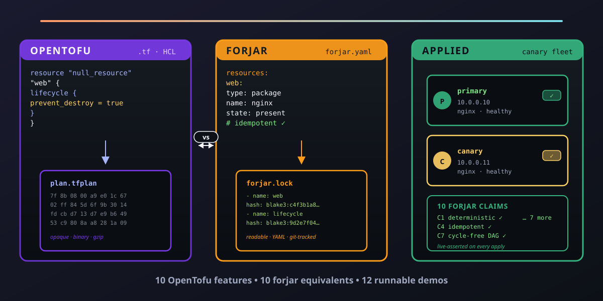

# iac-from-zero

<p align="center">
  
</p>

[](https://github.com/paiml/iac-from-zero/actions/workflows/ci.yml)
[](#license)
[](https://www.rust-lang.org/)

Companion repository for the **IAC from Zero** Coursera course — course 21 of
the [Rust for Data Engineering](https://www.coursera.org/specializations/rust-for-data-engineering)
specialization.

Twelve side-by-side demos that teach IAC fundamentals by pairing one OpenTofu
feature with its [`forjar`](https://github.com/paiml/forjar) equivalent. Every
demo ships both an HCL `main.tf` and a `forjar.yaml`, so the diff between the
two files IS the lesson.

## What this repo demonstrates

- **M1 — first apply** — declarative IAC, plan/apply, BLAKE3 lock files
  (cookbook recipe 01 `developer-workstation`)
- **M2 — state and plan** — saved plans (recipe 30) and JSON plan output
  (recipe 31): `tfplan` files vs forjar lock files; `terraform show -json` vs
  `forjar plan --format json`
- **M3 — lifecycle and refactoring** — `lifecycle` blocks (recipe 33),
  `moved` blocks (recipe 34), `-target` (recipe 36) vs forjar's idempotent
  recipes and content-addressed resource IDs
- **M4 — drift and convergence** — `refresh-only` (recipe 35),
  `check` blocks (recipe 32), `terraform_remote_state` (recipe 39) vs forjar's
  local BLAKE3 compare, runtime contracts, and pinned recipe imports
- **M5 — testing, security, capstone** — `.tftest.hcl` (recipe 37),
  state encryption (recipe 38), and a canary-deployment capstone (recipe 94)
  asserting all 10 falsifiable forjar claims against a real fleet

## Demo map

| Lesson | OpenTofu feature | forjar concept | Demo directory |
|---|---|---|---|
| 1.1.3 | `terraform apply` | `forjar apply` + BLAKE3 lock | [`m1-first-apply/`](m1-first-apply/) |
| 2.1.2 | `terraform plan -out=plan.tfplan` | `forjar plan --lock` | [`m2-state-and-plan/2.1.2-saved-plan/`](m2-state-and-plan/2.1.2-saved-plan/) |
| 2.1.3 | `terraform show -json` | `forjar plan --format json` | [`m2-state-and-plan/2.1.3-json-plan/`](m2-state-and-plan/2.1.3-json-plan/) |
| 3.1.1 | `lifecycle { prevent_destroy }` | idempotent recipe + content hash | [`m3-lifecycle/3.1.1-lifecycle/`](m3-lifecycle/3.1.1-lifecycle/) |
| 3.1.2 | `moved { from to }` | recipe composition by BLAKE3 ID | [`m3-lifecycle/3.1.2-moved-blocks/`](m3-lifecycle/3.1.2-moved-blocks/) |
| 3.1.3 | `terraform apply -target=` | `forjar apply --recipe` | [`m3-lifecycle/3.1.3-resource-targeting/`](m3-lifecycle/3.1.3-resource-targeting/) |
| 4.1.1 | `terraform plan -refresh-only` | local BLAKE3 hash compare | [`m4-drift/4.1.1-refresh-only/`](m4-drift/4.1.1-refresh-only/) |
| 4.1.2 | `check { assert {} }` | forjar runtime contracts (C1–C10) | [`m4-drift/4.1.2-check-blocks/`](m4-drift/4.1.2-check-blocks/) |
| 4.1.3 | `terraform_remote_state` | recipe import + hash pin | [`m4-drift/4.1.3-cross-config/`](m4-drift/4.1.3-cross-config/) |
| 5.1.1 | `.tftest.hcl` | `forjar plan-test` | [`m5-testing-security/5.1.1-testing-dsl/`](m5-testing-security/5.1.1-testing-dsl/) |
| 5.1.2 | `state_encryption {}` | content-addressed signed state | [`m5-testing-security/5.1.2-state-encryption/`](m5-testing-security/5.1.2-state-encryption/) |
| 5.1.3 | full canary fleet | recipe 94 + all 10 contracts asserted | [`m5-testing-security/5.1.3-capstone-canary-fleet/`](m5-testing-security/5.1.3-capstone-canary-fleet/) |

The cookbook recipe numbers (01, 30–39, 94) refer to
[`paiml/forjar-cookbook`](https://github.com/paiml/forjar-cookbook) — the
qualification suite that proves forjar against real infrastructure. Each demo
directory is a minimal restatement of one cookbook recipe paired with the
equivalent Terraform/OpenTofu HCL.

## Prerequisites

- Rust 1.75+ (`rustup default stable`) — for `cargo install forjar`
- `tofu` 1.7+ or `terraform` 1.5+ — for the OpenTofu/HCL side of every demo
- Docker — recipe 01 (M1) and recipe 94 (M5 capstone) use container transports

## Run the demos

```bash
git clone https://github.com/paiml/iac-from-zero
cd iac-from-zero

# One-time: install forjar from crates.io
make install

# Run validate + plan on all 12 demos (no real infrastructure touched)
make demo-all

# Run a single demo by lesson id
make demo-1.1.3       # first apply
make demo-2.1.2       # saved plans
make demo-5.1.3       # capstone canary fleet
```

`make demo-all` is the forjar half of the gate — it runs `forjar validate`,
`forjar plan`, and `forjar plan --json` on every `forjar.yaml`. The OpenTofu
half lives in two separate targets so the two toolchains stay decoupled:

```bash
make tofu-validate    # tofu init -backend=false + tofu validate per main.tf
make tofu-fmt         # tofu fmt -check per main.tf
```

No real apply runs unless you opt in with `make apply-<lesson-id>` (forjar
side, requires Docker on PATH).

## Labs

The [`labs/`](labs/) tree is the **learner-doing** half of this repo. Five
exercises map 1:1 to the five course modules, each with a starter
`forjar.yaml`, a reference solution under `solution/`, and a committed
`expected-*.json` fixture the solution must reproduce. CI gates the lab
solutions against drift via:

```bash
make verify           # scripts/verify-fixtures.sh — diff solutions vs expected-*.json
```

See [`labs/README.md`](labs/README.md) for the lab map and per-lab structure.

## Repo layout

| Top-level path | Role |
|---|---|
| `m1-…/` … `m5-…/` | Reading: 12 OpenTofu ⇄ forjar side-by-side demos |
| `labs/` | Doing: 5 exercises with `expected-*.json` fixtures |
| `recipes/` | Reference: one full data-engineering recipe (`de-pipeline-host.yaml`) |
| `capstone/` | The M5 capstone scaffold |
| `includes/` | Shared YAML fragments (policy defaults, notify hooks); symlinked into every demo dir |
| `scripts/` | `verify-fixtures.sh` and other CI helpers |
| `assets/` | Hero SVG + PNG |

## License

Dual-licensed under MIT or Apache-2.0 — pick the one that fits your downstream
use. SPDX: `MIT OR Apache-2.0`.
