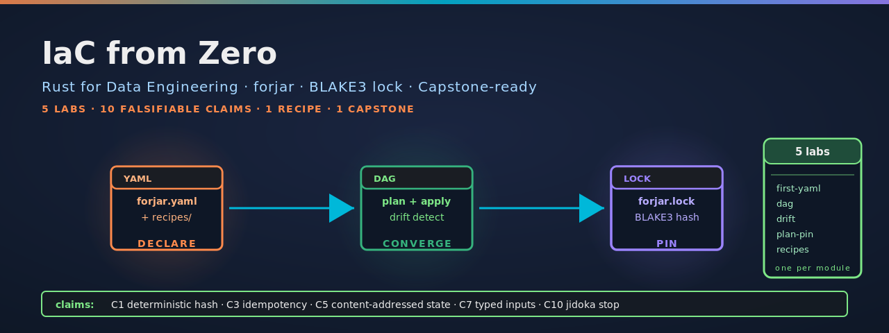

# IaC From Zero — Companion Repo



[](LICENSE)
[](https://github.com/paiml/forjar)
[](https://github.com/paiml/forjar)
[](labs/)
[](recipes/de-pipeline-host.yaml)
[](capstone/)
[](https://github.com/paiml/iac-from-zero/commits/main)
[](https://github.com/paiml/iac-from-zero)

Sibling repos in the same series:
[paiml/postgres-from-zero](https://github.com/paiml/postgres-from-zero) ·
[paiml/duckdb-from-zero](https://github.com/paiml/duckdb-from-zero) ·
[paiml/mysql-from-zero](https://github.com/paiml/mysql-from-zero)

The runnable companion to the Coursera course **IaC From Zero**, part of
the *Rust for Data Engineering* specialization. Declarative, bare-metal-first
Infrastructure as Code in Rust using **forjar** — a single-binary Rust IaC tool
with BLAKE3 content-addressed state and deterministic DAG execution. No cloud
APIs, no Terraform providers, no Ansible Python runtime. Just a YAML file, a
Rust binary, and a lock file.

## Installation

Prerequisites:

- Rust 1.95+ via rustup (`rust-toolchain.toml` pins to 1.95)
- `jq` for the self-check fixture diffs
- ~50 MB free disk for forjar + the per-lab `state/` directories

Clone and bootstrap:

    git clone https://github.com/paiml/iac-from-zero
    cd iac-from-zero

    # Install forjar — course-pinned to v1.3.0; v1.4.1 also works.
    cargo install forjar --version 1.4.1 --locked
    forjar --version          # → forjar 1.4.1

## Quick start

    make help        # list every Makefile entry point
    make validate    # forjar validate every lab solution + the recipe
    make plan        # forjar plan every lab solution
    make demo        # apply lab-01-first-yaml twice — second pass = 0 changes
    make verify      # diff each lab's status against expected-status.json

The labs are graded by `expected-status.json` / `expected-execution-order.json`
fixtures. `make verify` is the canonical green-tick: applies each lab solution
and diffs its current status against the committed fixture.

## Usage

The five module labs and the capstone live under `labs/` and `capstone/`:

```
labs/
├── lab-01-first-yaml/    # Module 1: declarative + plan/apply (claim C3 idempotency)
├── lab-02-dag/           # Module 2: depends_on + DAG resolver  (claim C2 + C4)
├── lab-03-drift/         # Module 3: drift detection + healing  (claim C5 + C6 + C10)
├── lab-04-plan-pin/      # Module 4: plans, moved blocks, pin   (claim C1)
└── lab-05-recipes/       # Module 5: typed inputs, composition  (claim C7)

recipes/
└── de-pipeline-host.yaml # the recipe Lab 5 produces; reused by the capstone

capstone/                 # stub pointing at the Coursera capstone reading
```

Each lab ships:

- `README.md` — learner-facing instructions + the "drill" that demonstrates
  the falsifiable claim
- `forjar.yaml` — starter config (TODO comments — learners finish it)
- `solution/forjar.yaml` (or `solution/de-{dev,staging}.yaml` for Lab 5) —
  reference implementation for instructor self-check
- `expected-*.json` — committed fixture for the self-check diff

## Falsifiable claims this course exercises

The course's pedagogical fingerprint is forjar's set of falsifiable claims.
Every module touches at least one by name:

| Claim | Statement                                                          | Where exercised |
|-------|--------------------------------------------------------------------|-----------------|
| C1    | Deterministic input hashing — same inputs in, same BLAKE3 out      | Lab 4, capstone |
| C2    | Deterministic execution order — Kahn topo sort + alphabetical tie  | Lab 2           |
| C3    | Idempotency — re-applying converged config yields 0 changes        | Lab 1, capstone |
| C4    | Cycles caught at parse time — no side effect, no partial apply     | Lab 2 (drill)   |
| C5    | Content-addressed state — lock file is the source of truth         | Lab 3, Lab 4    |
| C6    | Atomic state persistence — temp-file + rename, never torn writes   | Lab 3           |
| C7    | Recipe input validation — typed inputs fail at parse time          | Lab 5           |
| C10   | Jidoka — first failed resource halts; partial state preserved       | Lab 3 (drill)   |

The course teaches IaC by teaching **how to falsify claims about IaC tools.**
Every lab's "drill" is a concrete experiment that would expose the claim if
forjar were broken.

## Why bare-metal-first matters

forjar's strength is real machines over SSH. The labs deliberately reduce to
`localhost` because Coursera lab containers are single-host. The pedagogical
concepts — declarative, DAG, lock file, drift, store — are identical at
single-host scale. When you graduate from `addr: 127.0.0.1` to a fleet of
real bare-metal nodes, the YAML changes; the discipline doesn't.

Compared to the alternatives:

- **Terraform**: provider-shaped (every cloud has its own surface), remote
  state backend required, drift detection means polling APIs at scale.
  forjar walks a local lock file in milliseconds.
- **Ansible**: imperative playbooks, no concept of drift detection, "keep
  going past errors" by default. forjar declares relationships (DAG) and
  halts on first failure (Jidoka, C10).
- **Hand-rolled bash**: the failure mode this course was written to fix.

forjar is unapologetically bare-metal-first and Rust-only. The tradeoffs and
where the boundary sits are spelled out in Module 1.

## Capstone

The capstone is a **Reading** item in Module 5 of the Coursera course. The
`capstone/` directory in this repo is a stub. Students extend it with:

- `capstone/forjar.yaml` — composes `de-pipeline-host` with concrete inputs
  for a real Postgres + nightly-ETL host
- `capstone/state/forjar.inputs.lock.yaml` — committed pin lock (claim C1)
- A README documenting the C1/C5 falsifiable-claims framing
- Two PRs proving the `pin --check` CI gate works (one breaks it, one fixes)

The Coursera reading is the source of truth for the rubric. See
[`capstone/README.md`](capstone/) for the directory contract.

## Contributing

This repo is a companion artifact for the Coursera course. Substantive content
changes flow through the course's authoring workflow, not GitHub PRs. Bug
reports and reproductions of broken-on-clean-clone issues are welcome — open
an issue with the output of `make validate` and `make verify` and your
platform.

Local sanity checklist before submitting an issue:

    cargo install forjar --version 1.4.1 --locked
    make validate     # all five lab solutions + the recipe schema check
    make verify       # all six fixture diffs match
    make demo         # lab-01 applies, re-applies cleanly (claim C3)

## License

MIT. See [`LICENSE`](LICENSE). The forjar tool itself is dual-licensed
MIT/Apache-2.0 — see https://github.com/paiml/forjar for terms.
